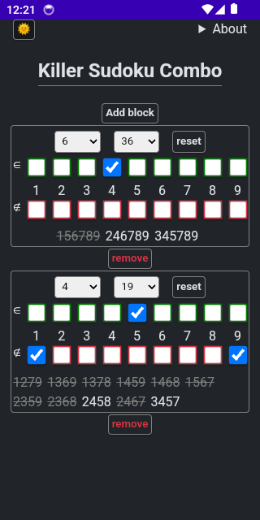
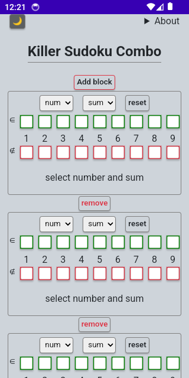
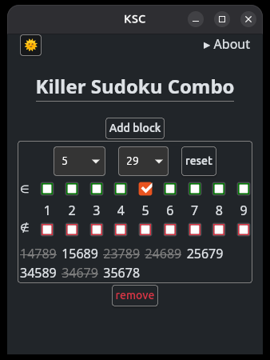
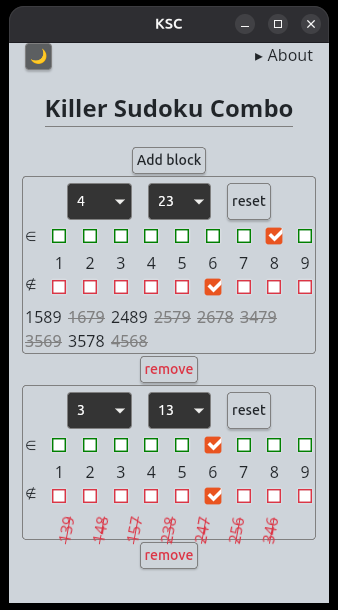

# KSC (KILLER SUDOKU COMBO)

A minimalist helper for solving Killer Sudoku puzzles (because why make it easy when you can play on the hardest difficulty? 😉)
Ported from my web version to a desktop/mobile app using Leptos + Tauri. 

*"My neurologist-approved memory hack: when sudoku makes you calculate 17+8+9 for the 100th time, you either improve or go insane. So far, so good!"*

<p align="center">
  
  
  
  
</p>

## Why Bother?
- ✓ Tiny (~4MB installers)
- ✓ No-nonsense UI (Dark/light theme, zero menus—just an "About" dropdown)
- ✓ Binary search under the hood

### Built With
- [Tauri](https://github.com/tauri-apps/tauri)(Rust-powered apps)
- [Leptos](https://github.com/leptos-rs/leptos)(Rust web framework)

## Install
You can find the android, deb, rpm in the Releases page.
### Android
Grab the APK from Releases, allow "Unknown Sources" & install manually
### Linux (.deb)
```bash
wget https://github.com/jager1win/ksc/releases/download/v1.0.0/KSC_1.0.0_amd64.deb
sudo dpkg -i KSC_1.0.0_amd64.deb
```
### Linux (.rpm)
```bash
wget https://github.com/jager1win/ksc/releases/download/v1.0.0/KSC-1.0.0-1.x86_64.rpm
sudo rpm -i KSC-1.0.0-1.x86_64.rpm
```
### Verify Signatures. All signatures are in the /sig folder
```bash
gpg2 --verify app.sig app
```
### Project Status
Done and dusted! No updates planned because:
- It works perfectly for my needs
- Mission accomplished: learned Tauri/Leptos

MIT - [LICENSE](LICENSE)

P.S. My first open-source project after 20 years in IT. Better late than never! 🚀